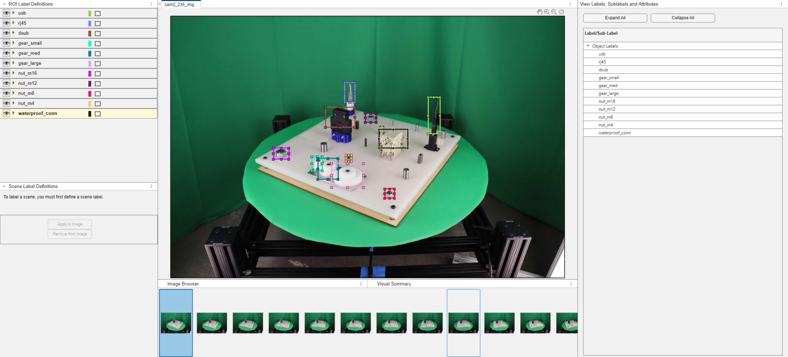

# Perception Template for Manufacturing Objects

This repository contains code to get started with perception for the [ICRA Robot Grasping and Manipulation Challenge (RGMC)](https://www.cse.usf.edu/~yusun/rgmc/2024.html), specifically the manufacturing track. The dataset used is the [NIST dataset](https://www.robot-manipulation.org/nist-moad) and the software used is MATLAB®️ 2023b.

## Getting started

To get started, clone this repository and download the 'nist_atb1_boardfull' dataset from the dataset. Further instructions on how to resolve the path in the image labeller app can be found in the live script.

The code requires the following:

- [Computer Vision Toolbox™](https://www.mathworks.com/products/computer-vision.html)
- [Deep Learning Toolbox™](https://www.mathworks.com/products/deep-learning.html)
- [YOLOv4 Object Detection](https://www.mathworks.com/matlabcentral/fileexchange/107969-computer-vision-toolbox-model-for-yolo-v4-object-detection)

For questions or clarifications on the code, please contact roboticsarena@mathworks.com

## License
The license is available in the [license.txt](license.txt) file in this GitHub repository.

## Community Support
[MATLAB Central](https://www.mathworks.com/matlabcentral/)

Copyright 2024 The MathWorks, Inc.
